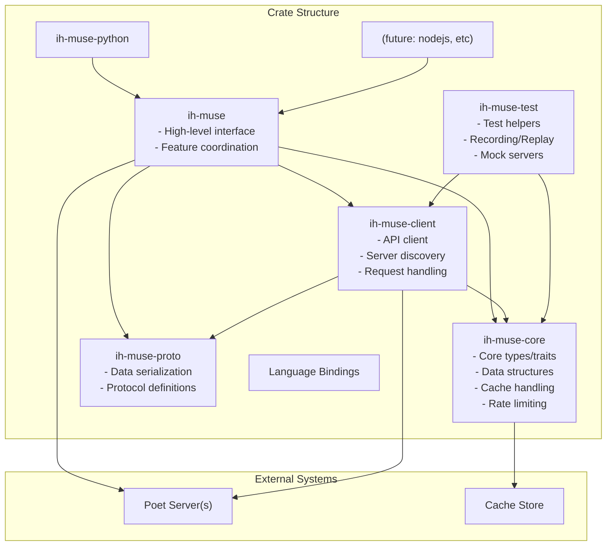

# Architecture Overview

The `ih-muse` project is composed of modular crates, each with distinct roles. Below is the flowchart representing the project structure and the data flow between components.

