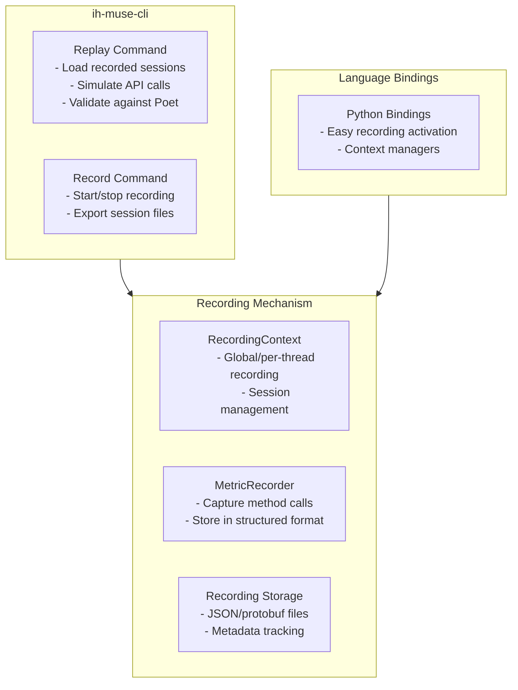

CLI functionality for test replay and add a recording mechanism.

```mermaid
flowchart TB
    subgraph CLI["ih-muse-cli"]
        replay["Replay Command
        - Load recorded sessions
        - Simulate API calls
        - Validate against Poet"]

        record["Record Command
        - Start/stop recording
        - Export session files"]
    end

    subgraph Recording["Recording Mechanism"]
        context["RecordingContext
        - Global/per-thread recording
        - Session management"]

        recorder["MetricRecorder
        - Capture method calls
        - Store in structured format"]

        storage["Recording Storage
        - JSON/protobuf files
        - Metadata tracking"]
    end

    subgraph Bindings["Language Bindings"]
        py["Python Bindings
        - Easy recording activation
        - Context managers"]
    end

    CLI --> Recording
    Bindings --> Recording
```
